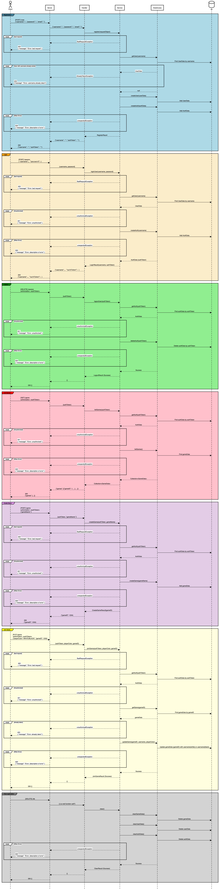

# ♕ BYU CS 240 Chess

This project demonstrates mastery of proper software design, client/server architecture, networking using HTTP and WebSocket, database persistence, unit testing, serialization, and security.

## 10k Architecture Overview

The application implements a multiplayer chess server and a command line chess client.

[](https://sequencediagram.org/index.html#initialData=C4S2BsFMAIGEAtIGckCh0AcCGAnUBjEbAO2DnBElIEZVs8RCSzYKrgAmO3AorU6AGVIOAG4jUAEyzAsAIyxIYAERnzFkdKgrFIuaKlaUa0ALQA+ISPE4AXNABWAexDFoAcywBbTcLEizS1VZBSVbbVc9HGgnADNYiN19QzZSDkCrfztHFzdPH1Q-Gwzg9TDEqJj4iuSjdmoMopF7LywAaxgvJ3FC6wCLaFLQyHCdSriEseSm6NMBurT7AFcMaWAYOSdcSRTjTka+7NaO6C6emZK1YdHI-Qma6N6ss3nU4Gpl1ZkNrZwdhfeByy9hwyBA7mIT2KAyGGhuSWi9wuc0sAI49nyMG6ElQQA)

## Modules

The application has three modules.

- **Client**: The command line program used to play a game of chess over the network.
- **Server**: The command line program that listens for network requests from the client and manages users and games.
- **Shared**: Code that is used by both the client and the server. This includes the rules of chess and tracking the state of a game.

## Starter Code

As you create your chess application you will move through specific phases of development. This starts with implementing the moves of chess and finishes with sending game moves over the network between your client and server. You will start each phase by copying course provided [starter-code](starter-code/) for that phase into the source code of the project. Do not copy a phases' starter code before you are ready to begin work on that phase.

## IntelliJ Support

Open the project directory in IntelliJ in order to develop, run, and debug your code using an IDE.

## Maven Support

You can use the following commands to build, test, package, and run your code.

| Command                    | Description                                     |
| -------------------------- | ----------------------------------------------- |
| `mvn compile`              | Builds the code                                 |
| `mvn package`              | Run the tests and build an Uber jar file        |
| `mvn package -DskipTests`  | Build an Uber jar file                          |
| `mvn install`              | Installs the packages into the local repository |
| `mvn test`                 | Run all the tests                               |
| `mvn -pl shared test`      | Run all the shared tests                        |
| `mvn -pl client exec:java` | Build and run the client `Main`                 |
| `mvn -pl server exec:java` | Build and run the server `Main`                 |

These commands are configured by the `pom.xml` (Project Object Model) files. There is a POM file in the root of the project, and one in each of the modules. The root POM defines any global dependencies and references the module POM files.

## Running the program using Java

Once you have compiled your project into an uber jar, you can execute it with the following command.

```sh
java -jar client/target/client-jar-with-dependencies.jar

♕ 240 Chess Client: chess.ChessPiece@7852e922
```

Server Diagram:

Image:




Link:

[Sequence Diagram](https://sequencediagram.org/index.html?presentationMode=readOnly#initialData=IYYwLg9gTgBAwgGwJYFMB2YBQAHYUxIhK4YwDKKUAbpTngUSWDABLBoAmCtu+hx7ZhWqEUdPo0EwAIsDDAAgiBAoAzqswc5wAEbBVKGBx2ZM6MFACeq3ETQBzGAAYAdAE5M9qBACu2AMQALADMABwATG4gMP7I9gAWYDoIPoYASij2SKoWckgQaJiIqKQAtAB85JQ0UABcMADaAAoA8mQAKgC6MAD0PgZQADpoAN4ARP2UaMAAtihjtWMwYwA0y7jqAO7QHAtLq8soM8BICHvLAL6YwjUwFazsXJT145NQ03PnB2MbqttQu0WyzWYyOJzOQLGVzYnG4sHuN1E9SgmWyYEoAAoJgMPvNISDfv9AfsQWDTl8AJSYHQo4AAaxgeg4MBRAEdUjlrtVRHcKjdnjAAELADgZdlqMAAUQAHipsAQClzqJRShViuZ6oEnE5hiNlnN1MB7HjlpKoN46oyRSyUOKcksrugOEqqDz7rJ5EoVOp6sawABVAYYt64qkexTKNSqO6VYy1ABiSE4MEDlHDjMsMBDszENJQ9JTAxgmyQYHiWZxOZgwAQtI4mZQ0rRGnDXqjvMqiJU9VTUHDLrdCOqAoUtfz9fa9PQMrlCsK-Ph93VGE1TmCurGBtURpNYzNFvq2bm1bHIsz8jp6ChZk4mFbkfUHaqIm7MDQPgQCAHKhjMm0bZ9EBaXRXtgwGcMw3-B9o3uOMFA4Zle37LtDHdKDvVUWogPzdEFB8MsMWAfD4ggu90PbWCdFqeDmTwst+zzAsWjLSgYH3aBv1Qvlh0tHw0EbbAUHAFAOBnFB5XyeceNVcplzAeoAFZtV1fUox3BZTXNaB6gxDg1CA4g5xgCAADMYEoC0HRvZ0UKfGEnktDIshySgMlUD8sHsuEnwXF5sSmHMlnqElliIst2ggS80CC5ZLhdViZPgZANRgcJlNGfz3kCmBguBULiIiqKYv2R1b08bw-H8aB2GNGJ4zgSVpDgBQYAAGQgLJCjk39fMaVoOm6HoDHUSSVMy3E9m+QkdkmmArgXX8vIFEYjxQNZpoBaFHm8ocXxQeoEA6pNQNW9b9D+HYqUYhkmRtO0sFsmTeuFUVbQ5KVZXEud4qgGS5NXHVRlUw1jQ0vctMtW62XeqynVMR7KnvDDfRQAMg1WyDPWg384xgRNkyQ7QMwrAK5jIrGMJ87lX0J+RqVpBl-WmYjoCQAAvETOI7Xq+LC+JWY50TPokxUFz+5KVxgLUAEYxq3dTgvY3jmbLAWRNhsqEb-Cmo3qbC5BQOj4jA0mUExiNKco+oaJgI2GIZmBmPiVila5p6eMPfjpUE4ShdnSSfvFkp5JgJTAb1Tc1NBxWIZ0vTVAMkW0GMsyLOgDXnXJi2KN211XztonCIKyL0CpR77iWy12s6tyPJNrK5jWPnCtLzBK6p5VLVeStPmC75m5L6K+-mnin3+1L0u702wf74uiuH6zTC8XwAi8FB0BiOJEjXjfq98LButzgUGmkSVWsldpJUG4bVFGlX+agdm8gKeoAB4B6i8ofsW7blo-9AtqwgSp2am+0YCHXsPvUC-80BUjdojciPoYB+iNkXcKg9zYARgrGKieMkzMj5umHQmYYFZywR3POYCC502uime+asbKgO5h7LM9DH6CzEknQOaoJYhxlnLKOu4laez5gwjO8MmFoR1kgvS3BcLETQfEFusCyHYytjIFAcjDCEKJsQ6sc90D03zAyJ2LsIZu24p3T2AkhLoj9l9AOYseHB0UpPYG25o6aQPDAXS+lH5JxTuZCG4jVGW1zkicgPhoIWMqJXeoe98K1wQMwDEZAokYSpO3RKvURgj07mPXh9Q0pOBgLkxe5UV7+BRMyfw2AkwMlamiGAABxHMGhD4gKsY0ZpF9Br2BzMMUR7Dn5oDfjAr+C0K6-y7jAwBDkeqgIOmiVpBpFHKLgVrJGutkGo1QTAzBaicH1HxgQ4iRCSEGMKFsx82TFm2zOdoIxBYmZDPZpzcu5QeZsLefYrhTjZKFKlk4WWQNI4gyEbHVhrzBYhM2YgzC4DlltPrqGUJFEjl4OTP0uY5ySYN1zA7UxsBXYfK+TY32nDvr-PHmHAR4KwbCJ8fHRORlTJBMsnNcp1yYLhNfHACAn5bGSVfislA4YJmSKmUAquSKDRJLABibFahMnTIoctMYSrVAaQaOMJVABJaQGlpZrBcKai4JrTWdDybcRK49ikbk1dq01LgrXlOXpVDgAB2NwTgUAlP8JKYIcAGoADZ4DAUMKKmARReELK6c0NoXRehKsGSzYZc4xmXPKA6nMAA5QKixryTNidMl4MCQRKvzb3MY14smdMoXrCNoq1mDzWJWnMV0HZQzehKGJz0RRinepSxx0lnEpS1OHdxCsvHaStMyaGEpYWSIQdIhFKCFH7LRTcjFJz9H0V0Rc9BUUt08vrRE6hwAnmM2+YLPtLDeZpp+cO0Wo6AUuKBSCiO8tPHg28Q+1W7D1acrhvA7W2ckH63RM29tcwDmWwxTbJV9tjGOxYsS8xpL71ex9nY59UlO5BxSrS0F36IXeN8QnfxrLU7BOA5rSVJbpX1DgE2nM8rFU5gNSq6Vaqu4as44a+o0twjBECNahKS5AX2oyvqwTMBhOidKpnd1ARLCaMOpsTeSAEhgDU5+CAmmABSEAkwtKrP4ZIoA6QxuDnGmo9Rmj+iTT0FNN6RmZqPegbNGVsAIGAGpqA-LDpQD2AAdRYHqy+PRBStQUHAAA0t8WTRqRNie-lKhyZbLnrT8wFoL0A20CbmTtM9r4ABWJm0DNvLTAXz-nKD5agIVuYXGr1zruu9O9XSXqDolHh7hb7x1uLBR4sjs7u33SXXtX83KUZgD2ZcuD6KjC4N3To+QxNSHcooeeh5NCHYvMfbezDXT-0PyfcLKlr7x78JI4IhlkKztiLo5nOFq65vQYE0t7dK3jn4OQTmXFsmT07dfEhx5tCax1nPFOfDlDmGnZvSJfr1LAVanXHd+lMdvFQ-HDDoqL3TCgdm1mbAWgoM5g4y16QaxTq1dyw1gV0BvvYN+ymMnBsAc4sLrJikxZSzllWhiTY8RSxm2MrAIXlmQB0k7SholbEMMMbJd7WxyPLsjoI2OyWxGv33ex7OijLLJKBLTiFwnIPbl7XqGk6JHyHhMZgMZpMor5U+Ntxktuqqrf2dKeJxclQ7Xaj926iqq8oD+a0zprwkfED5lgMAbAvnCAjOjR058vuT5nwvlfXoxh0uMcy37nxwAYBUBM8yEyfFwAm5ADWBAAB+bj8zeVgJANwPAGINnLrA1gvWHe+zaC75bjF0hNGo0MJKGolgyxJnsG1hXJLldYfJbhjXL6teDZ18N0jD3yPMqoybtlZuQnbZ9xEj3UYYkO6L3HvAbvUnpKjM3naR8u7+4Ke+4pIe4ZAA)


(Text)

actor Client

participant Server

participant Handler

participant Service

participant DataAccess

database db

entryspacing 0.9
group#43829c #lightblue Registration
Client -> Server: [POST] /user\n{"username":" ", "password":" ", "email":" "}
Server -> Handler: {"username":" ", "password":" ", "email":" "}
Handler -> Service: register(requestObject)
break bad request
Service -->Server: BadRequestException
Server-->Client: 400\n{ "message": "Error: bad request" }
end
Service -> DataAccess: getUser(username)
DataAccess -> db:Find UserData by username
break User with username already exists
DataAccess --> Service: UserData
Service --> Server: AlreadyTakenException
Server --> Client: 403\n{"message": "Error: username already taken"}
end
DataAccess --> Service: null
Service -> DataAccess:createUser(userData)
DataAccess -> db:Add UserData
Service -> DataAccess:createAuth(authData)
DataAccess -> db:Add AuthData
break Other Error
Service -->Server: unexpectedException
Server-->Client: 500\n{ "message": "Error: (description of error" }
end
Service --> Handler: RegisterResult
Handler --> Server: {"username" : " ", "authToken" : " "}
Server --> Client: 200\n{"username" : " ", "authToken" : " "}
end

group#orange #FCEDCA Login
Client -> Server: [POST] /session\n{ "username":"", "password":"" }
Server -> Handler: {username, password}
Handler -> Service: loginUser(username, password)
break bad request
Service -->Server: BadRequestException
Server-->Client: 400\n{ "message": "Error: bad request" }
end

Service -> DataAccess: getUser(username)
DataAccess -> db: Find UserData by username
DataAccess --> Service: UserData
break Unauthorized
Service -->Server: unauthorizedException
Server-->Client: 401\n{ "message": "Error: unauthorized" }
end

Service -> DataAccess: createAuth(username)
DataAccess -> db: Add AuthData
break Other Error
Service -->Server: unexpectedException
Server-->Client: 500\n{ "message": "Error: (description of error" }
end

DataAccess --> Service: AuthData (authToken)
Service --> Handler: LoginResult(username, authToken)
Handler --> Server: {"username": "", "authToken": ""}
Server --> Client: 200\n{"username": "", "authToken": ""}
end

group#green #lightgreen Logout
Client -> Server: [DELETE] /session\nauthorization: <authToken>
Server -> Handler: {authToken}
Handler -> Service: logoutUser(authToken)

Service -> DataAccess: getAuth(authToken)
DataAccess -> db: Find authData by authToken
DataAccess --> Service: AuthData
break Unauthorized
Service -->Server: unauthorizedException
Server-->Client: 401\n{ "message": "Error: unauthorized" }
end

Service -> DataAccess: deleteAuth(authToken)
DataAccess -> db: Delete authData by authToken
break Other Error
Service -->Server: unexpectedException
Server-->Client: 500\n{ "message": "Error: (description of error" }
end

DataAccess --> Service: Success
Service --> Handler: LogoutResult (Success)
Handler --> Server: {}
Server --> Client: 200 {}
end

group#red #pink List Games
Client -> Server: [GET] /game\nauthorization: <authToken>
Server -> Handler: {authToken}
Handler -> Service: listGames(authToken)

Service -> DataAccess: getAuth(authToken)
DataAccess -> db: Find authData by authToken
DataAccess --> Service: AuthData
break Unauthorized
Service -->Server: unauthorizedException
Server-->Client: 401\n{ "message": "Error: unauthorized" }
end

Service -> DataAccess: listGames()
DataAccess -> db: Find gameData
break Other Error
Service -->Server: unexpectedException
Server-->Client: 500\n{ "message": "Error: (description of error" }
end

DataAccess --> Service: Collection<GameData>
Service --> Handler: Collection<GameData>
Handler --> Server: {"games": [{"gameID": 1, ...}, ...]}
Server --> Client: 200\n{"games": [...]}
end

group#d790e0 #E3CCE6 Create Game
Client -> Server: [POST] /game\nauthorization: <authToken>\n{"gameName":""}
Server -> Handler: {authToken, "gameName":""}
Handler -> Service: createGame(authToken, gameName)
break bad request
Service -->Server: BadRequestException
Server-->Client: 400\n{ "message": "Error: bad request" }
end

Service -> DataAccess: getAuth(authToken)
DataAccess -> db: Find authData by authToken
DataAccess --> Service: AuthData
break Unauthorized
Service -->Server: unauthorizedException
Server-->Client: 401\n{ "message": "Error: unauthorized" }
end

Service -> DataAccess: createGame(gameName)
DataAccess -> db: Add gameData
break Other Error
Service -->Server: unexpectedException
Server-->Client: 500\n{ "message": "Error: (description of error" }
end

Service --> Handler: CreateGameResult(gameID)
Handler --> Server: {"gameID": 1234}
Server --> Client: 200\n{"gameID": 1234}
end

group#yellow #lightyellow Join Game #black
Client -> Server: [PUT] /game\nauthorization: <authToken>\n{"playerColor":"WHITE/BLACK", "gameID": 1234}
Server -> Handler: {authToken, playerColor, gameID}
Handler -> Service: joinGame(authToken, playerColor, gameID)
break bad request
Service -->Server: BadRequestException
Server-->Client: 400\n{ "message": "Error: bad request" }
end

Service -> DataAccess: getAuth(authToken)
DataAccess -> db: Find authData by authToken
DataAccess --> Service: AuthData
break Unauthorized
Service -->Server: unauthorizedException
Server-->Client: 401\n{ "message": "Error: unauthorized" }
end

Service -> DataAccess: getGame(gameID)
DataAccess -> db: Find gameData by gameID
DataAccess --> Service: gameData
break already taken
Service -->Server: unauthorizedException
Server-->Client: 403\n{ "message": "Error: already taken" }
end


Service -> DataAccess: updateGame(gameID, username, playerColor)
DataAccess -> db: Update gameData (gameID) with username(white) or username(black)
break Other Error
Service -->Server: unexpectedException
Server-->Client: 500\n{ "message": "Error: (description of error" }
end

DataAccess --> Service: Success
Service --> Handler: JoinGameResult (Success)
Handler --> Server: {}
Server --> Client: 200 {}
end

group#gray #lightgray Clear application
Client -> Server: [DELETE] /db
Server -> Handler: {} (a void function call?)
Handler -> Service: clear()

Service -> DataAccess: clearGameData()
DataAccess -> db: Delete gameData
Service -> DataAccess: clearUserData()
DataAccess->db:Delete userData
Service -> DataAccess: clearAuthData()
DataAccess->db:Delete authData
break Other Error
Service -->Server: unexpectedException
Server-->Client: 500\n{ "message": "Error: (description of error" }
end

DataAccess --> Service: Success
Service --> Handler: ClearResult (Success)
Handler --> Server: {}
Server --> Client: 200 {}
end
